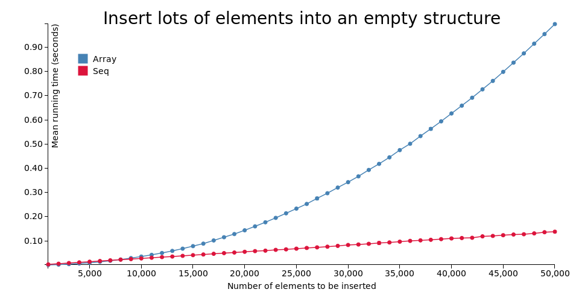
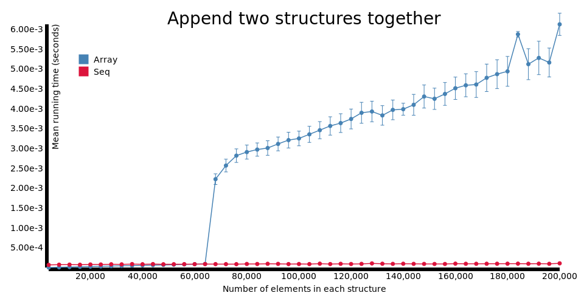
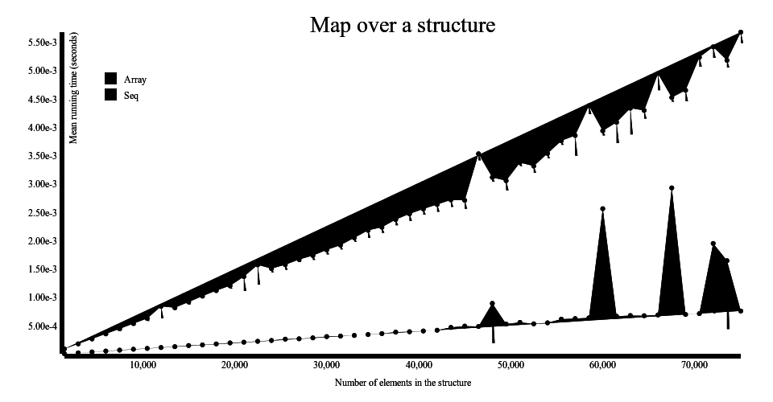
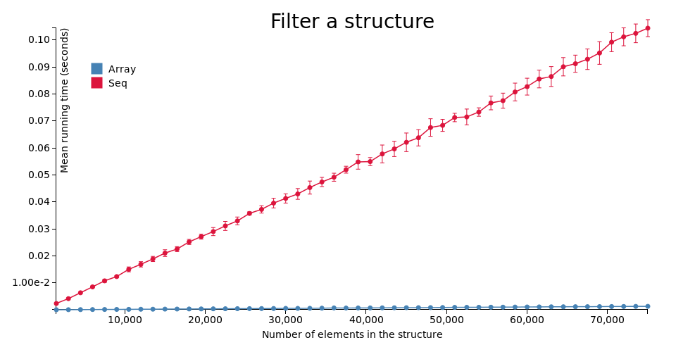
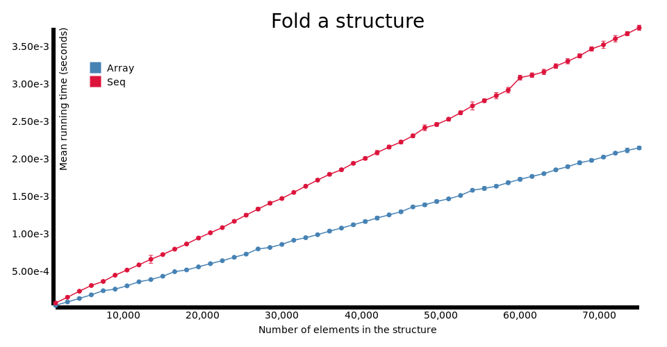
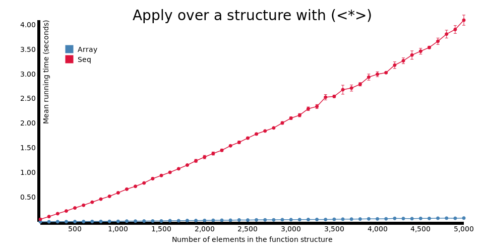
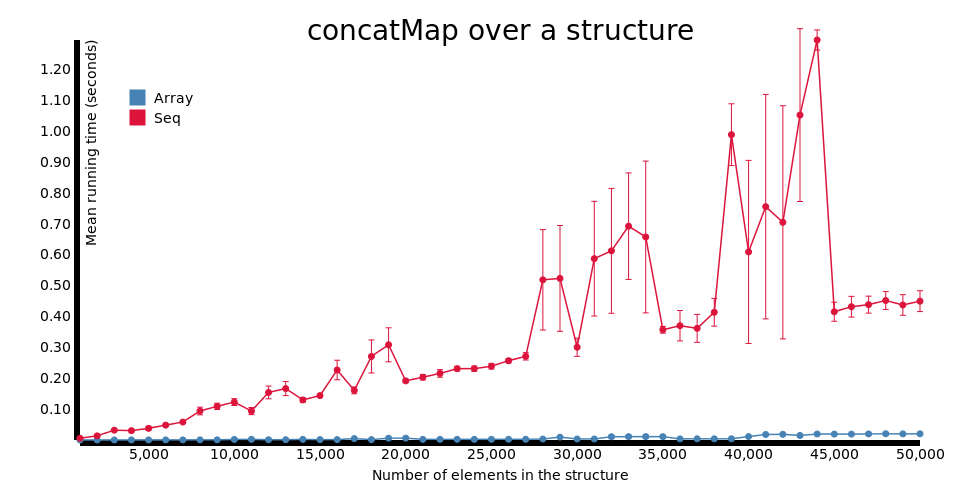
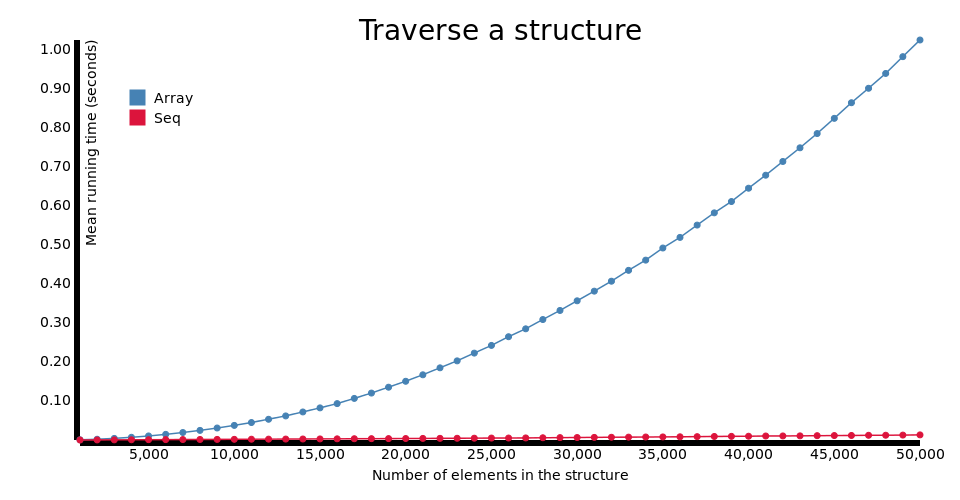
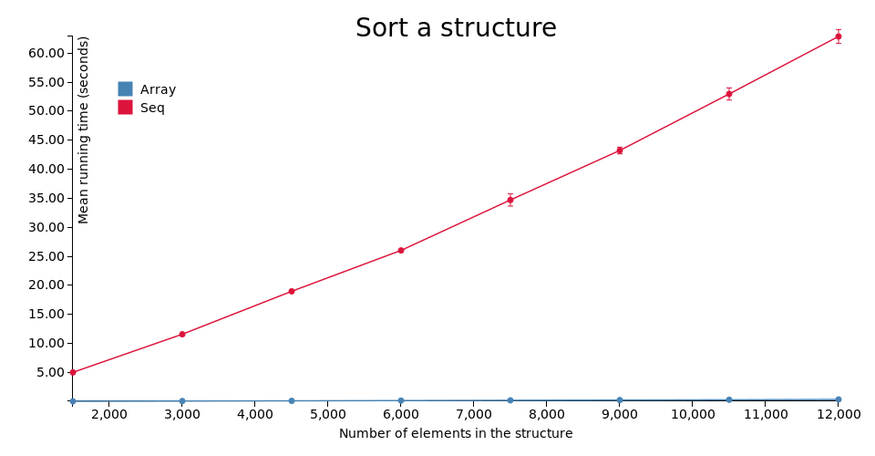

# purescript-sequences

[](https://travis-ci.org/hdgarrood/purescript-sequences)

Various efficient-ish sequence types for PureScript.

The implementations are based on 2-3 finger trees, as described in the paper
[_Finger Trees: A Simple General-Purpose Data Structure_][1], Ralf Hinze and
Ross Paterson, Journal of Functional Programming 16:2 (2006) pp 197-217.

Big props also go to [taku0](https://github.com/taku0) who did most of the
initial work on this.

## Documentation

Documentation is published on
[Pursuit](https://pursuit.purescript.org/packages/purescript-sequences). You
probably want one of `Data.Sequence`, `Data.Sequence.NonEmpty`, or
`Data.Sequence.Ordered`. This package also provides `Data.FingerTree`, which is
the common foundation with which these three types are implemented, and may
also be useful for implementing other data structures.

## Why not just use Arrays all the time?

JavaScript's Array type is designed for use in an imperative programming
environment, where anything can be mutated at any time. This means that reusing
them is usually not possible. For example:

```javascript
var as = [1,2,3]
var bs = as.concat([4,5,6])
bs[0] = 10
```

`as[0]` should still be 1 after executing these statements. Therefore, `concat`
has to copy the whole array, and is therefore O(n + m), where n and m are the
lengths of the arguments.

However in PureScript, values are immutable. So we may take advantage of this
by writing functions that reuse parts of data structures where possible.
Sequences are one such structure &mdash; in this case, the amortized complexity
of `concat` is reduced to O(log(min(n1, n2))), where n1 and n2 are the lengths
of the arguments.

Amortized complexities of other operations:

|               | Native array | Sequence            |
|---------------|--------------|---------------------|
| cons/uncons   | O(n)         | O(1)                |
| getAt i       | O(1)         | O(log(min(i, n-i))) |
| setAt i       | O(n)         | O(log(min(i, n-i))) |
| splitAt i     | O(n)         | O(log(min(i, n-i))) |


## When to use Seq (and when not to)

Unfortunately the constant factors for this library are not fantastic at the
moment &mdash; see the following heading for more information. In particular,
for small structures (those which have less than 1000 elements), `Array` tends
to outperform `Seq`. Therefore, I suggest sticking with `Array` in most cases.
If you know that your sequences will be much larger than this, or if you have
already diagnosed and identified the `Array` type as the source of a
performance issue, `Seq` ought to be a good option.

Additionally, if you are using JavaScript libraries via the FFI, and passing
Arrays back and forth between PureScript and JavaScript, you might find that
it's easier and more efficient to just use Arrays. Generally, JavaScript
libraries will not be able to use the `Seq` type in this library, and so you
would have to convert between `Seq` and `Array` at the PS/JS boundaries. The
conversion in either direction is O(n).

## Is it faster?

Not always. As of yet, the PureScript compiler's optimizer is not very
sophisticated, particularly with respect to the code generation when using type
classes. Because of how this library is written, it suffers from this &mdash;
even though the asymptotics for `Seq` are very good, the constant factors are
often not so good. For example:











[1]: http://staff.city.ac.uk/~ross/papers/FingerTree.pdf
